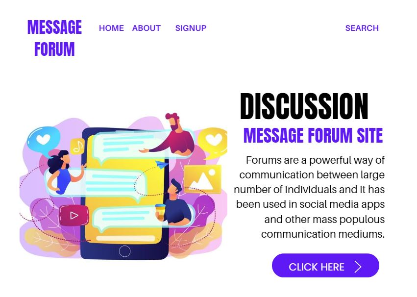
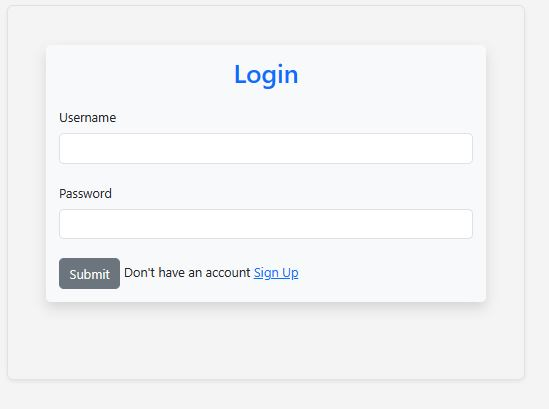
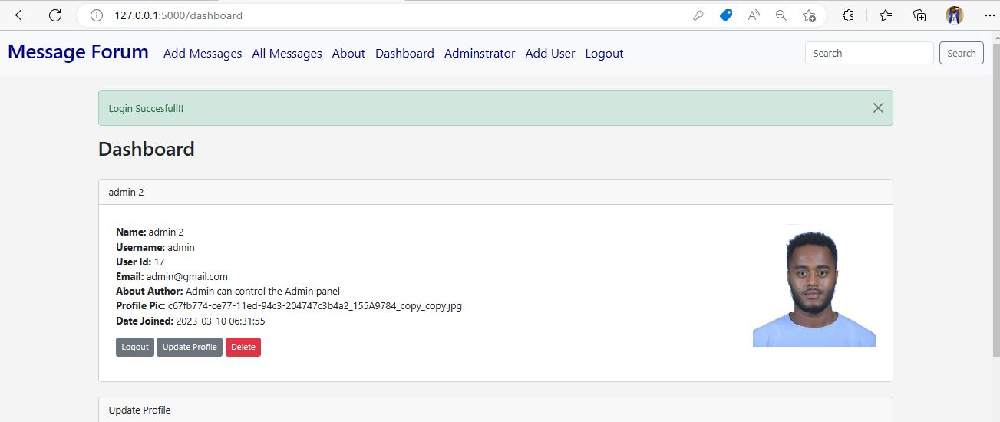
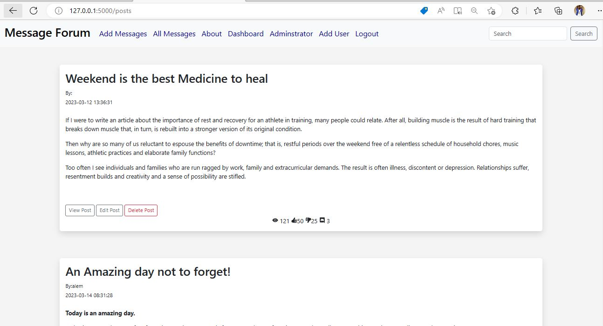
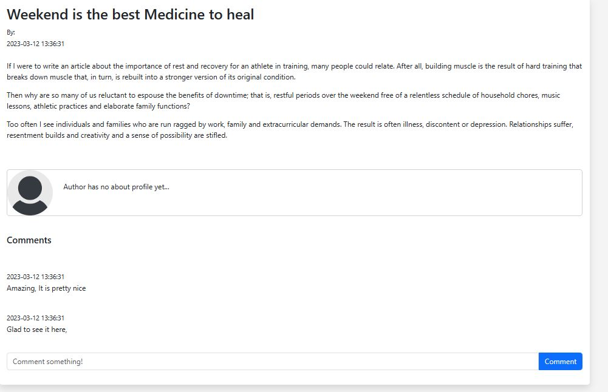
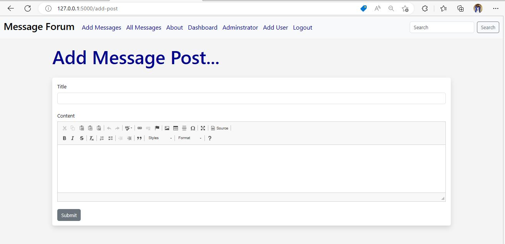
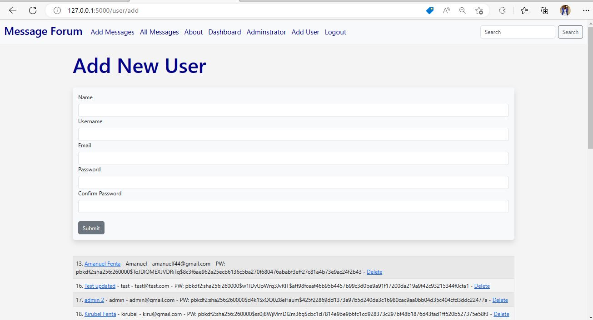
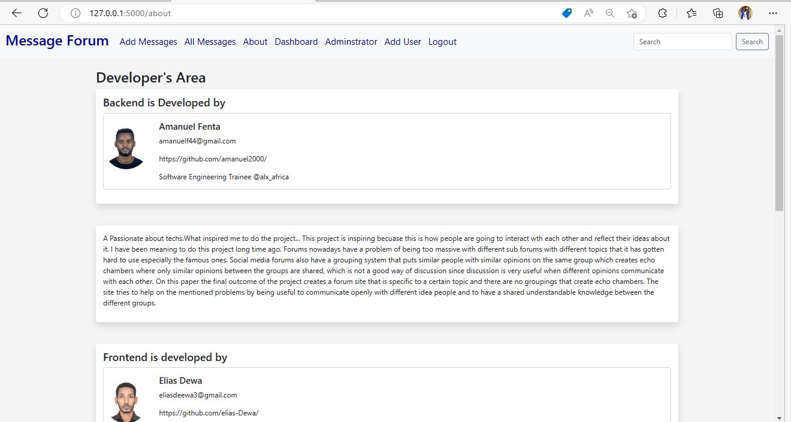

# Discussion and Message Forum Site

## Description

Forums are a powerful way of communication between large number of individuals and it has been used in social media apps and other mass populous communication mediums.

- Forums nowadays have a problem of being too massive with different sub forums with different topics that it has gotten hard to use especially the famous ones.

- The final outcome of the project creates a forum site that is specific to a certain topic and there are no groupings that create echo chambers.

- The site tries to help on the mentioned problems by being  useful to communicate openly with different idea people and to have a shared understandable knowledge between the different groups.

- After the completion of the project a functioning forum site with message management, comment management with attached message. Also vote count for message and comment is also added.

- Messages and comments with the highest relevance and showed more clearly by the use of votes. There is search filter added for users to find what they want. It also has management side for forum manager users to manage the proper interaction between users.

- There is a functionality that can be used by all users to report a message or comment based on their
opinion if they deem it inappropriate or unreadable or other factors. Because there may be abusers
or other type of users that can use the system for other purpose that the main goal of the site. So, form manager users see this reports and use their own judgement to take action.

## Scope

- The scope of the project is to develop a web-based messaging forum site that will have a specific topic that users will come for that specific topic and know what kind of information they will find. It will have subtopics of the main topic that will give more specificity for users to find their wants easily

## System Development Methodology

- The development strategy used for the project will be RAD which is agile so its iterative and capable of change. Agile development compared to others is with repeated phases for additional functionality. Additions or changes in requirement or functionality can be handled better through  agile development, because it’s not only one way to develop the project it’s through cycles which doesn’t make it rigid but capable of change

## System Development Tool

- ### Flask

It is a web framework, it's a Python module that lets you develop web applications easily. It's has a small and easy-to-extend core: it's a microframework that doesn't include an ORM (Object Relational Manager) or such features. It does have many cool features like url routing, template engine.

- ### Jinja

It is a web template engine for the Python programming language. It was created by Armin Ronacher and is licensed under a BSD License. Jinja is similar to the Django template engine but provides Python-like expressions while ensuring that the templates are evaluated in a sandbox.

- ### Python

It is a computer programming language often used to build websites and software, automate tasks, and conduct data analysis. Python is a general-purpose language, meaning it can be used to create a variety of different programs and isn't specialized for any specific problems.

- ### MySQL

It is a relational database management system (RDBMS) developed by Oracle that is based on structured query language (SQL). A database is a structured collection of data. It may be anything from a simple shopping list to a picture gallery or a place to hold the vast amounts of information in a corporate network.

- ### HTML

HTML stands for Hyper Text Markup Language. HTML is the standard markup language for creating Web pages. HTML describes the structure of a Web page. HTML consists of a series of elements. HTML elements tell the browser how to display the content.

- ### CSS

CSS stands for Cascading Style Sheets. CSS describes how HTML elements are to be displayed on screen, paper, or in other media. CSS saves a lot of work. It can control the layout of multiple web pages all at once. External stylesheets are stored in CSS files.

- ### JavaScript

JavaScript is a lightweight programming language that web developers commonly use to create more dynamic interactions when developing web pages, applications, servers, and or even games. Developers generally use JavaScript alongside HTML and CSS The scripting language works well with CSS in formatting HTML elements

- ### Bootstrap

Bootstrap is a free and open-source CSS framework directed at responsive, mobile-first  front-end web development. It contains CSS and (optionally) JavaScript-based design templates  for typography, forms, buttons, navigation, and other interface components.

- ### Visual Studio Code

 It also commonly referred to as VS Code, is a source-code editor made by Microsoft with the Electron Framework, for Windows, Linux and macOS. Features include support for debugging, syntax highlighting, intelligent code completion, snippets, code refactoring, and embedded Git.

## Business Rules

The system is role-based sort of system. Currently only four roles are used. One is an administrator role next is forum manager and the other is normal user role and the last is non logged in user role.

## Functional Requirements

- User Sign up for new forum users.
- Login functionality.
- Category and Message page for logged in and non-logged in users.
- Read messages, comments, vote counts for all users.
- Add message for logged in users.
- Edit message for message writer logged in user.
- Add comment for logged in users.
- Edit comment for comment writer logged in user.
- Report message and comments if logged in user found it in-appropriate.
- Vote on message and comment functionality for logged in users can Approve and  Not Approve
- Show vote counts on messages and comments for Approve, Not Approve.
- User management for administrative users.
  - Add User
  - Edit User
  - Delete User
- Category management for administrative users.
  - Add Category
  - Delete Category
- Message Management for forum manager users.
  - Delete Message
  - Delete Comment
- Report Management for forum manager users.
  - Flagged Messages
  - Flagged Comments

## SYSTEM DESIGN

- The Message Forum Site is a web application site that is needed to be accessed with multiple users from different locations at any time. Because of that the system must be networked over internet  to achieve these goals.
From what is gathered in the requirements, the System will have a web server to display the site  and to interact with users. It will also have a database server to store the historical and new data of users

## Proposed Software Architecture

- For the development process and what is currently used is all the frameworks and applications are  stored on a single device making the project a single-tier framework. But if the system is to expand database, front end and back end can be split into three separate devices easily, making it multi-tier framework.

## Security

For security front end validation and server-side validation are user. On front end form validations and auth session is checked when doing work. On server-side user session is checked for permission validation

## Communication

On communication the front end and backend communicate with REST apis. And backend and database communicate with the MySql module installed by pip.

## Presentation Layer

This is what the user will use on its end. And it is developed by the use of python flask for front end
control and html, css and bootstrap for the look and design of the pages

## Application Layer

This is the part that will control the interactions with the persistent data store and the user’s interaction. Flask and Python, are used for processing the user’s requests and communicating with the database.

## Data Management Layer

This is the place where all the needed historical and current data are stored. Registered user,  messages, comments and other data are all stored on the database. And this project uses MySQL  database.

In general, the proposed project is designed to be created by these bellow frameworks.

- Front End: Bootstrap, CSS, HTML5
- Back End:  python flask
- Database:  MySql DB 8.0
The frameworks mentioned are all open source and free to use and are updated regularly so they are good platforms to pick

## Implementation

- The Project is a web application with persistent data and user interface. So, to accomplish that these frameworks are used
• Windows Operating System
• Flask Framework
• Python
• MySQL Database

## Mapping Models to Code

### Mapping Associations

    - Unidirectional one-to-one associations
    - Bidirectional one-to-one associations
    - One-to-many associations
The Comments are mapped to Comments Table. Comment Votes are mapped to CommentVotes Table. Messages are mapped to Messages Table. Message Votes are mapped to MessageVotes Table. User are mapped to Users Table. Message Views are mapped to MessageViews Table.

## Screen Images

### Home Page

### Login

### Sign Up

### Dashboard

### All Messages

### Single Post

### Add Messages

### Add User

### About

### Admin Area

### Purpose of our project

 The purpose of our project is to build a discussion message forum site that. The final outcome of the project creates a forum site that is specific to a certain topic and there are no groupings that create echo chambers. The site tries to help on the mentioned problems by being useful to communicate openly with different idea people and to have a shared understandable knowledge between the different groups.

### Our Team Members

- Amanuel Fenta
- Elias Dewa
- Anania Baharu

This project was created for everyone who wants to discuss issues with the group. Anyone with issues can bring his idea to the forum site. After that the forum site members can discuss with it.

Our personal focus was to build a blog site at first and we were tried to discuss about it. but later we decided to come up with one step better for a message forum site. therefore, people can interact with each other by creating an account at the site.

We all our team was happy to work on the project that encourages people to engage with ideas that can bring them together. this was our best come up.  We are a student who has always been passionate about technology and loves exploring new programming languages and frameworks. During our coursework, we learned about Flask and MySQL, and we were fascinated by their capabilities to develop robust web applications. We had been looking for an opportunity to work on a project that would allow us to apply our knowledge and skills in web development, and our school project presented the perfect opportunity. We saw this project as a chance to showcase our abilities and create something that could be used by others.
We spent countless hours researching and planning the project, designing the database schema, and developing the web application. Despite the technical challenges, we enjoyed the process and felt a sense of accomplishment with every milestone achieved. As we worked on the project, we realized that this experience had deepened our understanding of web development, taught us valuable lessons in project management, and improved our problem-solving skills. We felt proud of what we had accomplished and were excited to present the final product to our mentor and peers.

In conclusion, the reason why we chose to work on this project using Flask and MySQL was because of our passion for technology and our desire to apply our knowledge and skills to a practical project. We saw it as an opportunity to grow and learn, and we felt a sense of accomplishment as we worked towards completing it.

### What we have accomplished with our project

We have accomplished a project that is capable of registering users, posting messages, editing messages, deleting messages, and managing user’s dashboard. We have used for the Fronted HTML5, CSS3 Bootstrap and some JavaScript and for the backend logic we used Flask Python and MySQL. We have used frameworks because of the time limit and the learning curve that will take to us.
Feature: Flask. It is functionality that has value for the user used authentication purpose. Not a feature: The entire application is styled with bootstrap. there is no functionality mentioned here

### Technical difficulties and challenges

Early in the project I had decided to deploy my web on the given web server. I had some difficulties to do that. I have tried to research and google to many things. And I also had a challenge to add a feature of the comment, likes and views section on the posts. but due to the time I had I was not able to finish them at all. finally, we come up to just do the MVP part of our project. There can be various technical challenges while developing a website for a school project using Flask and MySQL. However, one of the most challenging tasks can be designing and implementing a database schema that can efficiently manage the data of the website.

To develop a robust website using Flask and MySQL, you need to design a database schema that can handle different types of data and relationships between them. You need to consider various factors such as data normalization, indexing, query optimization, and data security while designing the schema. Additionally, implementing a robust data access layer that interacts with the database can also be challenging. You need to ensure that the data access layer handles database connections efficiently, manages transactions, and prevents SQL injection attacks.
Another challenge could be ensuring the website's scalability and performance. The website must be able to handle a large number of concurrent users, and the database must be able to handle a high volume of requests efficiently. You can achieve this by optimizing the database schema and tuning the database server's configuration. Overall, developing a website using Flask and MySQL requires a strong understanding of web development, database design, and server-side programming. It may require you to invest significant time and effort in planning, designing, and testing to ensure a successful project.

### What we have learned

There are several technical takeaways from developing websites using Flask and MySQL:  Flask is a lightweight and flexible web application framework that provides a lot of freedom to the developer. It allows for rapid development and is well-suited for small to medium-sized web applications. MySQL is a popular relational database management system that is widely used for web applications. It is scalable, reliable, and supports multiple users simultaneously.
Flask and MySQL can be integrated easily using a variety of libraries and modules, such as Flask-MySQL dB and Flask SQL Alchemy. These modules provide a convenient and efficient way to interact with the database. One important technical consideration when using Flask and MySQL is security. It is crucial to ensure that the application is protected from SQL injection attacks and other security vulnerabilities. Flask provides built-in security features, such as CSRF protection, while MySQL provides tools for securing the database, such as user authentication and encryption.

Another technical takeaway is the importance of optimizing database queries for performance. MySQL provides several optimization techniques, such as indexing and query caching, that can improve the performance of the application. Flask and MySQL are both open-source technologies, which means that there is a large community of developers and users who can provide support and resources. This can be helpful when troubleshooting issues or seeking advice on best practices.
Finally, using Flask and MySQL allows for a lot of flexibility in terms of deployment options. Flask can be deployed on a variety of servers and platforms, while MySQL can be installed on multiple operating systems.

This means that the application can be easily scaled up or down based on the needs of the business or organization. Overall, using Flask and MySQL to develop web applications provides a lot of benefits in terms of flexibility, scalability, and performance. However, it is important to consider security and optimization when using these technologies, and to leverage the resources of the open-source community.
While developing a website using Flask and MySQL, there are several things that you might do differently to improve the development process and the final product. Use a Flask extension for handling forms: Flask-WTF is a popular extension that simplifies the process of handling forms in Flask applications. It provides built-in protection against common web application vulnerabilities, such as cross-site request forgery (CSRF) and cross-site scripting (XSS). Use SQL Alchemy to interact with the database: SQL Alchemy is a popular Python library that provides a powerful object-relational mapper (ORM) for working with databases. It can simplify the process of interacting with MySQL, allowing you to work with Python objects instead of SQL statements.

Use caching to improve performance: Caching is a technique that involves storing frequently accessed data in memory or on disk, reducing the number of times the data needs to be retrieved from the database. Flask provides several caching options, such as Flask-Cache, which can be used to improve performance. Use a content delivery network (CDN): A CDN can be used to serve static assets, such as images and CSS files, from a geographically distributed network of servers. This can improve the speed and reliability of the website for users around the world.

Implement authentication and authorization: Authentication is the process of verifying the identity of a user, while authorization is the process of determining whether a user has access to a particular resource. Flask provides several extensions, such as Flask-Login and Flask-Security, that can be used to implement authentication and authorization. Use unit testing to ensure code quality: Unit testing involves testing individual components of the website to ensure that they work as expected. This can help catch bugs early in the development process, improving code quality and reducing the likelihood of errors in the final product.

Optimize database queries: Poorly optimized database queries can lead to slow performance and poor user experience. Using MySQL's query optimization techniques, such as indexing and query caching, can improve performance and reduce the time required to retrieve data from the database. By implementing these best practices, you can improve the development process and the final product when developing a website using Flask and MySQL. As an engineer, developing a website using Flask and MySQL can provide you with several valuable lessons and experiences, such as:

The importance of choosing the right tools for the job: Flask and MySQL are just two of many tools available for web development. By choosing the right tools for the job, you can improve the efficiency and effectiveness of your development process. The value of understanding how web frameworks work: Flask is a lightweight and flexible web application framework that requires the developer to have a good understanding of how web frameworks work. By working with Flask, you can improve your knowledge of web development and enhance your skills as an engineer.

The importance of maintaining code quality: Maintaining code quality is essential for any software development project. By adhering to best practices, such as using unit testing and optimizing database queries, you can improve the quality of your code and reduce the likelihood of errors and bugs. The need for effective communication and collaboration: Developing a website using Flask and MySQL requires effective communication and collaboration between team members. By working together, you can share ideas, solve problems, and create a better final product.

The value of continuous learning: The field of web development is constantly evolving, and there is always something new to learn. By staying up to date with the latest technologies and best practices, you can continue to improve your skills as an engineer and stay ahead of the curve. In summary, developing a website using Flask and MySQL can provide valuable lessons and experiences for engineers, including the importance of choosing the right tools, maintaining code quality, effective communication and collaboration, and continuous learning.
Developing a website using Flask and MySQL can inform your engineering path in several ways, such as: It can help you determine your interests and strengths: Working on a project like this can help you identify what areas of engineering you enjoy and excel in. For example, you may discover that you are particularly interested in web development or database management. It can help you gain practical experience: Developing a website using Flask and MySQL provides you with practical experience that can be invaluable in your future engineering career. You can apply the knowledge and skills you gained during the project to future projects and situations.

It can help you build your portfolio: Adding a project like this to your portfolio can showcase your skills and expertise to potential employers or clients. It can demonstrate your ability to work with web frameworks, databases, and other technologies. It can help you network and connect with other professionals: Working on a project like this can help you connect with other professionals in the field. You can share your experience, ask for advice, and build relationships with others who share your interests. It can inspire you to continue learning and growing: The field of engineering is constantly evolving, and there is always something new to learn. Working on a project like this can inspire you to continue learning and growing in your career. In summary, developing a website using Flask and MySQL can inform your engineering path by helping you determine your interests and strengths, gain practical experience, build your portfolio, network and connect with other professionals, and inspire you to continue learning and growing in your career.

### About Us

I am passionate about technology and enjoy working on challenging programming projects. I take pride in my ability to design and develop high-quality web applications that meet the needs of clients and users. My love for programming is fueled by my curiosity and desire to stay up to date with the latest technologies and best practices in the industry.
"I'm a full stack software engineer with a passion for creating high-quality web applications. With experience in languages like Python, JavaScript, and HTML/CSS, I have the skills to design and develop effective solutions for a wide range of clients. I'm always learning and staying up to date with the latest technologies and best practices to ensure that my work is cutting-edge. You can find out more about me and my work by visiting me at

# Authors

## 1. Amanuel Fenta Dejen

- [Github](https://amanuel2000.github.io/)

- [Linkedin](https://www.linkedin.com/in/amanuel-fenta-a4683a215/)

- [Twitter](https://twitter.com/amanuel_Fenta2/)

## 2. Elias Dewa Ahmed

- [Github](https://www.github.com/Elias-Dewa)

- [Linkedin](https://www.linkedin.com/in/eliasdewa14/)

- [Twitter](https://twitter.com/eliasdewa14/)

## 3. Anania Baharu Tadesse

- [Github](https://amanuel2000.github.io/)

- [Linkedin](https://www.linkedin.com/in/amanuel-fenta-a4683a215/)

- [Twitter](https://twitter.com/amanuel_Fenta2/)